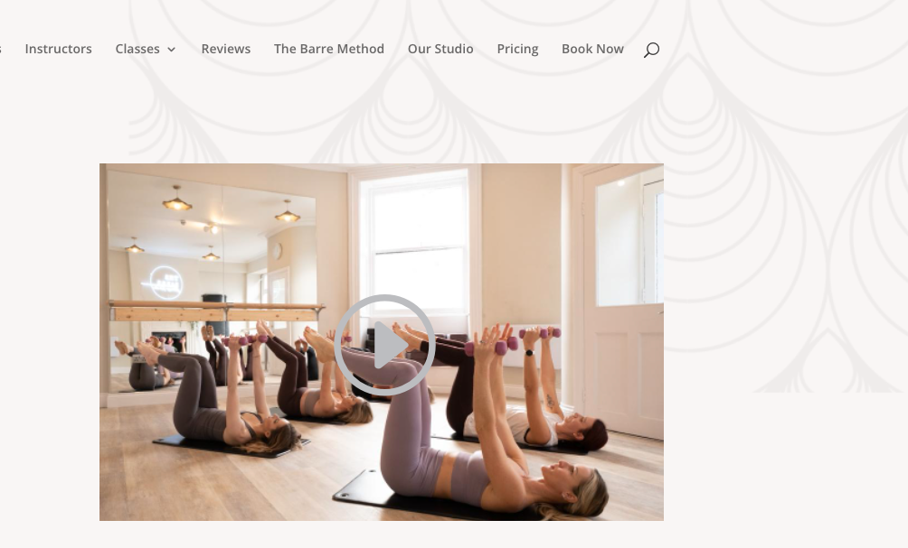
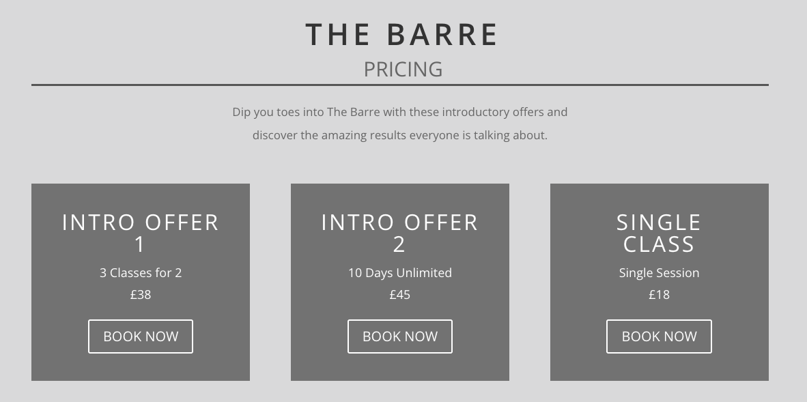
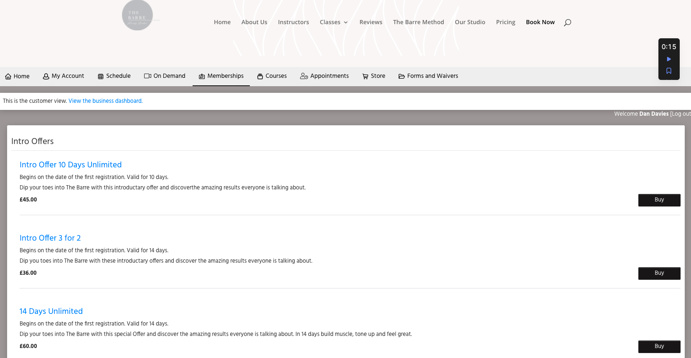

Introduction
------------

Barre Fitness is an exercise studio in Bristol which opened after the last lockdown. A large amount of the customers are from the local area but passing traffic was initially slow. A website was created to principally “un-frost” the gym windows so its potential clientele could understand what kind of studio it is and what class costs.

The site was built quickly to build advertise the gym and also mitigate the shortfall in passing traffic post lockdown. The owner believes that the majority of the audience would book classes in person so priority wasn’t given to an integrated membership, booking system and store. This system is dealt with through a third party [TeamUp app](https://goteamup.com/). 

 

Current site UX: Surface
------------------------

The [current site](https://thebarrefitnessstudio.co.uk/) is based in Wordpress it was created by a web company. Who did a good enough job of using design which might appeal to a 20-40 largely female UK audience. Font choices and some of the background patterns add a nice sense of art-deco class. Although they often are ’sliced up’  it doesn’t really chime with the actual feel of visiting the studio. 

 


 

I undertook some paid work to add some further images, video and copy-check the site. It’s clear that the site has suffered from 'feature creep'. 

 


This is largely due to the owner wanting to advertise the studio, instructors, classes and deals. 

The second most fundamental issue with the site is that due to low technical knowledge from the owner. Which is why TeamUp has been integrated as an iframe. 

A new user journey is currently confused. You can find out lots of background information (see navbar) including class pricing. 

 


But then you have to find the same class offer in the TeamUp app displayed within an iFrame. And the user then has to sign up with TeamUp.



The TeamUp is a market leader and despite an old looking UI does function quite well. Once the user is signed up they are advised to download the app to manage their schedule. Which functions well. The owner admits that there is significant drop off between visiting the site and paying for anything.

In addition to buying training/session packs. The shop which has become a more important daily form of income for the business is very poor in the Team Up UI. 

The main priority of this MVP is to get the shop / point of sale working and integrated into a functional shop window and also looking good. 

The booking and membership functionality and calendar will be dealt with in a later version of development. 

UX and DB Priorities
-------------

1.  To produce a cleaner shop intergration which can be linked to and from the current site in the navigation

2.  Make buying kit from the shop or class bundles a pleasure. 

3. Integrate site with Stripe so that member can pay

3. Create a login area so members can order and go back to basket

 

User Stories
------------

The surface developer goals for this current MVP are. 

+--------------------------+------------------------------------------+
| **As a…**                | **I want to be able to**                 |
+--------------------------+------------------------------------------+
| Site visitor             | understand what the Barre Fitness shop is, and    |
|                          | who and what this site is for            |
+--------------------------+------------------------------------------+
| New customer / returning | Have an enticement to buy membership or  |
|                          | from the shop                            |
+--------------------------+------------------------------------------+
| New customer             | see further information about            |
|                          | introductory offers and memberships      |
+--------------------------+------------------------------------------+
| New customer / returning | login to account to see membership       |
|                          | status and what is booked / bought and shipped      |
+--------------------------+------------------------------------------+

For later sprints
+--------------------------+------------------------------------------+
| New / returning customer | see what classes there are and people    |
|                          | who run them                             |
+--------------------------+------------------------------------------+
| Returning customer       | see what classes are available and how   |
|                          | many spaces are available                |
+--------------------------+------------------------------------------+
| New / returning customer | see a calendar view of available classes |
+--------------------------+------------------------------------------+

 

Scope
-----

### Sprint 1: Scope (1 week)

1.  Research look and layout the site with the 5 planes of UX (Research, ReadME, Wireframes)

2.  Planning out work process deadlines, work structure and testing implementation

 

### Sprint 2: Structure and Skeleton(2 weeks)

1.  Code out site structure, repo and basic layout

2.  Export shop databases from TeamUp, restructure in JSON Format

3.  Structure databases in Django’s SQL DB

### Sprint 3: Skeleton, structure and surface

1.  Create basic shopping app from end-to-end based on learning in previous Walkthroughs.

2. Create fixtures from current shop within team-up

3. Add pictures and styling which chime with current branding. (see design)

4. Deploy to Heroku, add images to AWS - issues with [deployment to Heroku](#automated-deployment-suspension) and timescale to get AWS working. Content freeze for CI Marking.

### Sprint 4 structure

1. Mop up of previous issues and process.

2. Create new project Kanban. 

3. Stage media connect Django to AWS S3

4. Stripe integration

5. Working basket and members area

5. Map out DB interrelation for members - booked classes etc

### Sprint 5 Surface

1. Work on customer to and from public WP and this proposed version

2. Add other elements so site could potentially replace more of the site.

3. Reintroduce Team-Up purely as a booking service within site.

Later sprints

1.  Upload membership database and link member info with history (anonmised for from TeamUp)

2. Integrate members calendar and booking system into Database.


 

Languages Used
--------------

-   [HTML5](https://en.wikipedia.org/wiki/HTML5)

-   [CSS3](https://en.wikipedia.org/wiki/CSS)

-   [JavaScript](https://en.wikipedia.org/wiki/JavaScript)

-   [jQuery](https://en.wikipedia.org/wiki/JQuery)

-   [Python](https://en.wikipedia.org/wiki/Python_(programming_language))

Frameworks, Libraries & Programs Used
----------------------------------------------------------------------------------------------------------------------------------------------

 

-   [Django](https://www.djangoproject.com/) - main framework for building site including specific intergrations includedd 

-   Bootstrap 4 for styling and layout

-   [Heroku](https://dashboard.heroku.com/) The cloud platform for deploying the app.

-   [Git](https://git-scm.com/) Used Git for version control by utilizing the Gitpod terminal to commit to Git and Push to GitHub.

-   [GitHub](https://github.com/) GitHub stored the projects code after being pushed to Heroku via Flask

-   [Balsamiq](https://balsamiq.com/) To create initial wireframes for the project design - full wireframes can be seen here.

-   [Photoshop](https://www.adobe.com/uk/products/photoshop/) Used to crop, resize and optimise main illustration - also experimented with Google Webp image

 

Deployment
----------

### Database Deployment

Django will do most of the work of preparing and setting up the database through 'migrations'.

To update the database to the latest models, from the project root:

1.  First generate the python migration scripts:

`python3 manage.py makemigrations`

1.  Then run the scripts and update the database:

`python3 manage.py migrate`

### Local Deployment

To deploy the project locally first clone the github repository to a local directory:

-   Navigate to the project's github repository (<https://github.com/dandavies23/barre-fitness>)

-   Select the "Code" button above the file listing

    -   Select download Zip

-   unzip the file to a local directory

#### Python Environment

After cloning the repository the python environment needs to be set up. Ensure python3 is installed and is version 3.8.6 minimum with the command: `python3 --version`

You will then need to create a virtual environment: From the projects local root directory run the following command:

`python3 -m venv .`

To activate the virtual environment use the command:

`source bin/activate`

Once the virtual environment is activated the project's python prerequists can be installed with:

`pip3 install -r requirements.txt`

Database migrations should now be run as outlined above.

Once finished working, or if the virtual environment needs to be restarted (for instance if environment varibles have change and need to be reloaded) deactivate by typing:

`deactivate`

## Heroku Deployment
Before following the steps listed below, a requirements.txt file and a Procfile were created and pushed to GitHub from Gitpod using the following commands:

    pip3 freeze --local > requirements.txt
    echo web: python app.py > Procfile

Then to integrate APScheduler into the application to automate the awards() & new competition processess I added a second dyno to my Procfile --> clock: python jobs.py Referring to the jobs.py file where the scheduled jobs are listed.

Use the Heroku CLI to scale up the clock process using the command: heroku ps:scale clock=1

The application was deployed via Heroku using this process:
Navigated to Heroku
Signed into my Heroku account.
Selected "New" on the dashboard and then "Create new application" option as below:


Selected a name for my application, selected "Europe" as the region and clicked "Create app".

5. With the "Deploy" tab selected, "GitHub - Connect to GitHub" was chosen as the deployment method. 


6. Make GitHub profile is, click "connect" next to the GitHub repository for this project.


7. Navigate to the "Settings" tab and clicked on "Reveal Convig Vars".
Added configuration variables to Heroku.
Navigated back to the "Deploy" tab and selected "Enable Automatic Deploys" with the master branch selected from the dropdown box.

10. Then clicked on "Deploy Branch" also with master selected.

11. Site is deployed and any changes are automatically deployed each time they are updated and pushed to GitHub during development.

## Automated Deployment suspension

_NOTE: Due to a security issue, Heroku disabled automated deployments from GitHub during the development of this app. On [30th May 2022](https://status.heroku.com/incidents/2413) this was resolved but on 3rd June 2022 it was still disabled for this app. The following additional steps are needed to push to both repositories. There are additional steps if you have MFA/2FA authentication activated you need to retrieve the API key from the dashboard and use this when prompted._ 

1. Open terminal in Gitpod.
2. Get your app name from Heroku:
Enter the following command in the terminal: heroku apps
4.   Set the Heroku remote. (Replace <app_name> with your actual app name and remove the <> characters)
Enter the following command in the terminal: heroku git:remote -a <app_name>
5.   Add and commit any changes to your code, if applicable.
Enter the following command in the terminal: 
```git add . && git commit -m "Deploy to Heroku via CLI"``` 
 6.   Push to both GitHub and Heroku
Enter the following command in the terminal: ```git push origin main```
Enter the following command in the terminal: ```git push heroku main```

_Whilst the problem persistes must do this every time you push to ensure that both repo's are the same_

_In order to push to Heroku you will need to login through the CLI for every Gitpod session. ``` heroku login -i ``` using your email as login and Heroku API as password._

Other thanks and acknowledgments
--------------------------------------------------------------------------------------------------------------------------------------

Thanks to Georgie from Barre Fitness for input and access to Team Up. Thanks to Code Institute support including my mentor Antonio and Tutors Jo, Sean and Christine. I’m thankful for the support, and advise and tolerance from  Juliet Spare, and Pete Doyle plus CI Slack and Stack Overflow communities.

 

 
